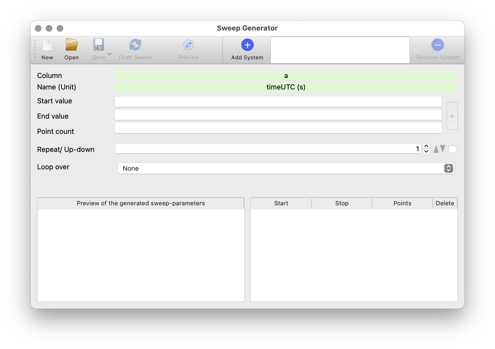
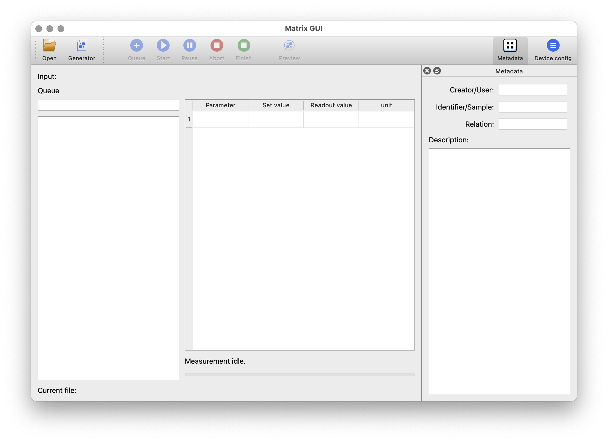
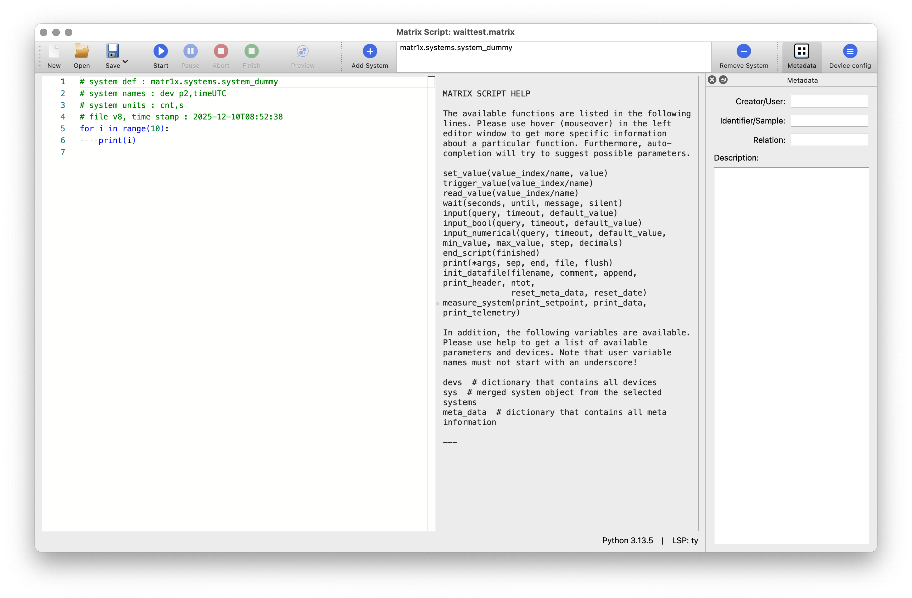
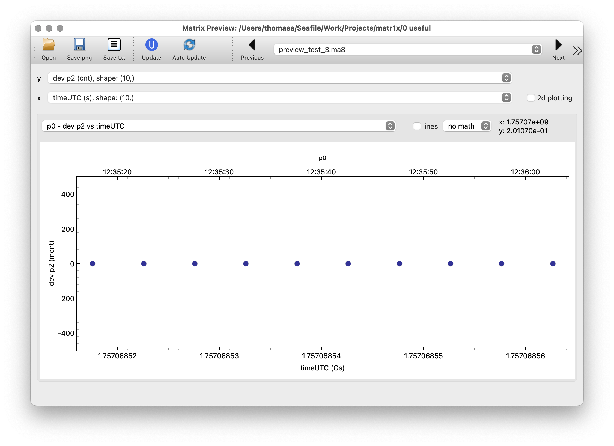
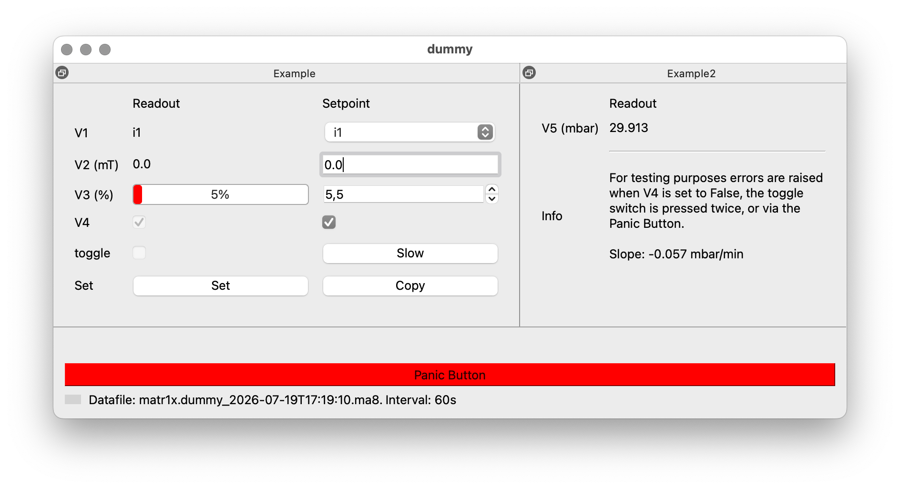

# Matr1x

Python tools for data recording, instrument control and visualization.

## Further information

Please use the full [user-guide](https://andythomas.github.io/matr1x/) for detailed information including installation instructions, usage examples, and troubleshooting tips.

## Why Matr1x?

There are several good Python software packages that provide a framework for measurements and general instrument control.
However, Matr1x aims to provide a more integrated user experience via a collection of tools that work together seamlessly.
Matr1x can orchestrate device drivers, based on [PyMeasure](https://pymeasure.readthedocs.io/), [PyVisa](https://pyvisa.readthedocs.io/), or any other Python package, and provides several applications with a graphical user interface.

## How it works

A person with some experience in Python programming creates a small, so-called system file that connects to the instrument drivers (e.g. a multimeter) and defines the desired parameters (e.g. current and voltage).
Then, even users with no Python experience can use Matr1x to perform measurements, while more advanced users benefit from a code editor based on Monaco (which powers VS code) that allows them to write custom measurement scripts.
Another tool for data visualization is provided as well.

## Impressions of the software

### Sweep Generator

Application to generate sweeps to perform measurements.

### Matrix GUI

Read previously generated sweep data and perform (a series of) measurements.

### Matrix Script

Run measurements or control other instruments in an integrated environment.

### Matrix Preview

Quickly preview the results of the measurements or collected log data.

### Control GUIs

If even more control is required, custom panels called "control-GUI" can be added via an additional file.
Then, manual control and general observation of the desired devices can be performed.

## Requirements

A Windows, Linux or Mac OS X computer with a Python installation (3.10 - 3.14) is successfully tested to run the software.
