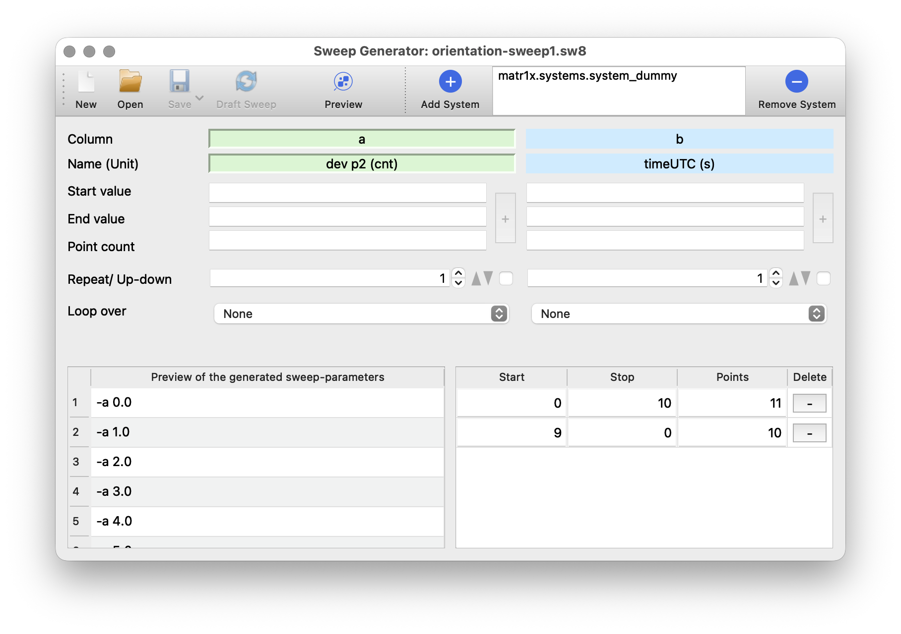
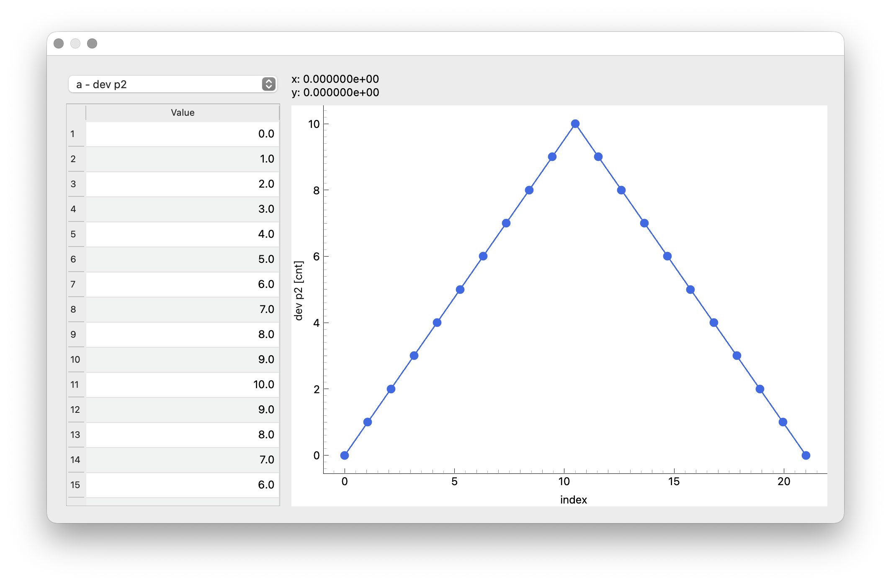
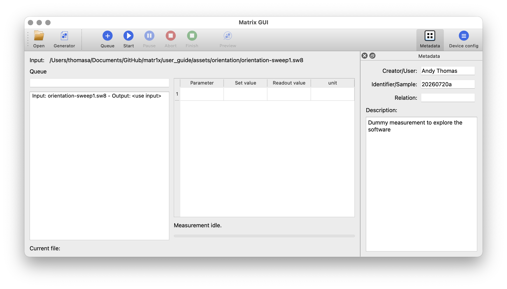
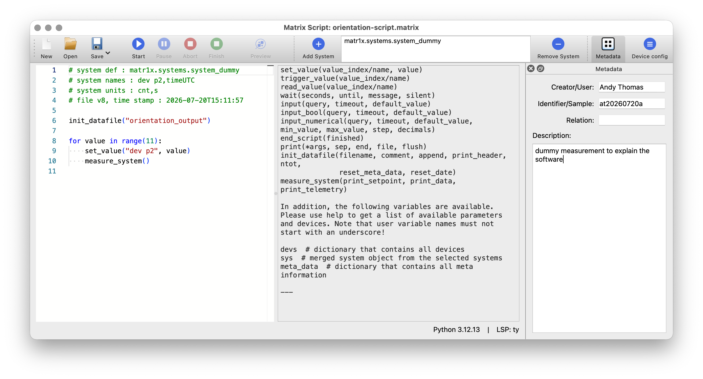
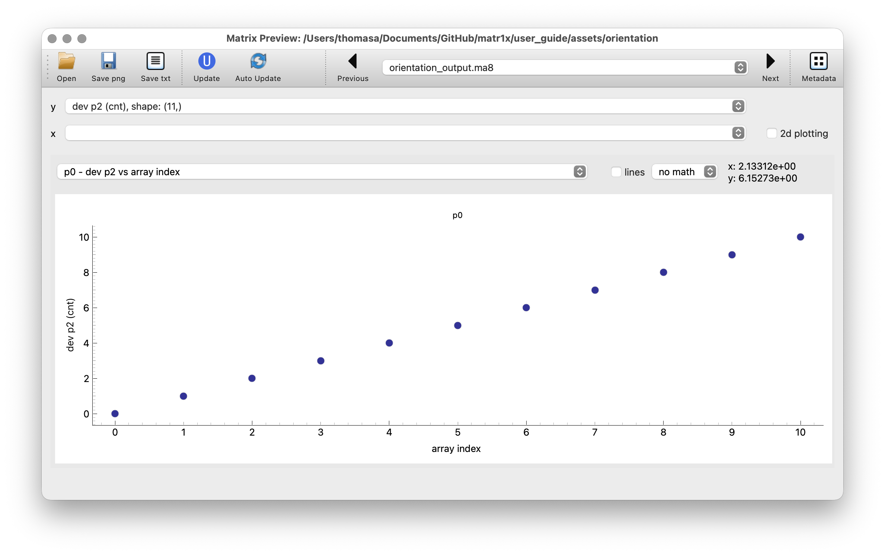

# Orientation

As described before, a person with some experience in Python programming creates a small, so-called system file that connects to the instrument drivers.
To give a better idea of the required coding effort and the resulting instrument control, we will have a look at an example.

## Required coding effort

We will have a look at `system_dummy.py`, which is part of this package.



The `dummy` device driver is imported to mimic a device but to be able to run the example on any computer.
Then, `System` is imported as the base class for the system definition.
The file defines exactly one local `System` subclass, `Dummy`, which Matrix detects and instantiates.
Metadata can be added using a subset of the [Dublin Core vocabulary](https://en.wikipedia.org/wiki/Dublin_Core).
In our example, only "source" is set.
The imported dummy device is added to the list of devices and, finally, one `Parameter` is added to the system, which is used to read and write data from the device.
Now, we can utilize this system-file in several ways.

## No-Code instrument control

We can load the system file into the sweep generator and use it to control the device.
This is shown in the screenshot below.

We added a sweep that starts at 0 and increases to 10 in steps of 1.
Afterwards, we added a second sweep that starts at 10 and decreases back to 0 in steps of 1.
In a real device, we could imagine a voltage source, where we could sweep the voltage from 0 to 10 V and back to 0 V.
The sweep can be visualized utilizing the preview icon in the toolbar.

If we got the desired sweep, we can save it as a file.
Afterwards, we can startup `matrix-gui` and can load this sweep file.

We enter more information to be saved as metadata (Creator, Identifier and a description) and press queue measurement.
Pressing "Start" would now perform the measurement.

## Script instrument control

If a more fine grained control is needed, a script can be used to control the device.
The example shows the basic functionality.
In a nutshell, any Python code plus a few custom commands for the device control and read-out can be used.

In our case, the values are swept from 0 to 10 in steps of 1.
After each step, the a measurement is performed and the following lines illustrate the required coding effort.

```python
init_datafile("orientation_output")

for value in range(11):
    set_value("dev p2", value)
    measure_system()
```

For scripts whose measurement flow is statically known, `matrix-script`
automatically determines the total number of points for progress and remaining
time estimation. Dynamic loops and branches continue to run normally, but do
not have a known total.

## Data Preview

Matrix Preview can show the raw data from the measurement.
Basic row selection, zooming and metadata inspection are available.

This concludes the orientation examples showcasing most of the basic functionality.
